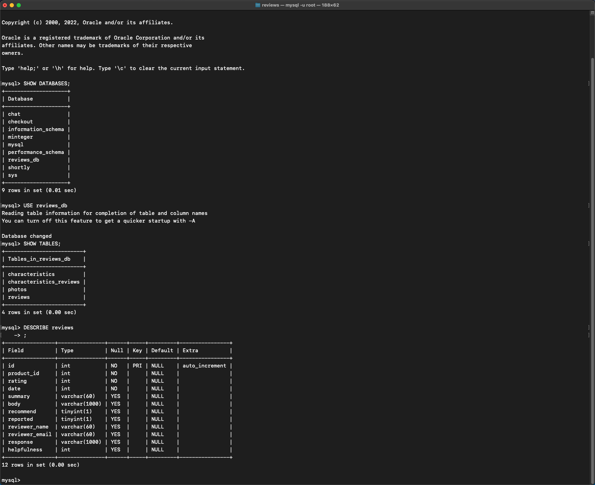

# June 28th, 2022

## Goals:
- [ ] create user with ability to login
- [ ] set up postgreSQL tables
- [ ] import data into postgreSQL tables

## Notes:
- NEVER INSTALL POSTGRESQL *ANYTHING* USING ANTHING BUT HOMEBREW!!!!

## CLI Scripts:
- Login to postrges master user: ```psql -U postgres;```
- Give the role permission to log in: ```ALTER ROLE "*username*" WITH LOGIN;```

### Change psql port number:
*previous port number === 5432*
- cd /opt/homebrew/var/postgres/
- #port = 5431
- vim postgresql.conf

**SWITCHING TO MYSQL!!!**

## Error codes:
- mysql> LOAD DATA LOCAL INFILE "/Users/tylernourse/hackReactor/rpp35/reviews/CSVs/reviews.csv" INTO TABLE reviews COLUMNS TERMINATED BY ',' OPTIONALLY ENCLOSED BY '"' LINES TERMINATED BY '\n' IGNORE 1 LINES;
ERROR 3948 (42000): Loading local data is disabled; this must be enabled on both the client and server sides
mysql>
- mysql> LOAD DATA INFILE "/Users/tylernourse/hackReactor/rpp35/reviews/CSVs/reviews.csv" INTO TABLE reviews COLUMNS TERMINATED BY ',' OPTIONALLY ENCLOSED BY '"' LINES TERMINATED BY '\n' IGNORE 1 LINES;
ERROR 1290 (HY000): The MySQL server is running with the --secure-file-priv option so it cannot execute this statement


