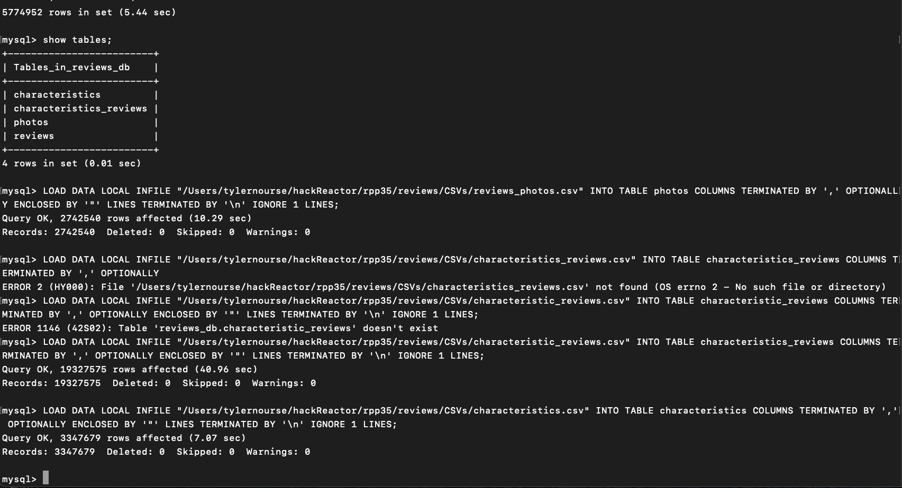

# July 2nd, 2022

## Goals:
- [X] solve permissions issues to load in csv files
- [X] import data into mySQL tables
  -   mysql> LOAD DATA LOCAL INFILE "/Users/tylernourse/hackReactor/rpp35/reviews/CSVs/reviews.csv" INTO TABLE reviews COLUMNS TERMINATED BY ',' OPTIONALLY ENCLOSED BY '"' LINES TERMINATED BY '\n' IGNORE 1 LINES;
  -   LOAD DATA LOCAL INFILE "/Users/tylernourse/hackReactor/rpp35/reviews/CSVs/reviews_photos.csv" INTO TABLE photos COLUMNS TERMINATED BY ',' OPTIONALLY ENCLOSED BY '"' LINES TERMINATED BY '\n' IGNORE 1 LINES;
  -  LOAD DATA LOCAL INFILE "/Users/tylernourse/hackReactor/rpp35/reviews/CSVs/characteristic_reviews.csv" INTO TABLE characteristics_reviews COLUMNS TERMINATED BY ',' OPTIONALLY ENCLOSED BY '"' LINES TERMINATED BY '\n' IGNORE 1 LINES;
  -  LOAD DATA LOCAL INFILE "/Users/tylernourse/hackReactor/rpp35/reviews/CSVs/characteristics.csv" INTO TABLE characteristics COLUMNS TERMINATED BY ',' OPTIONALLY ENCLOSED BY '"' LINES TERMINATED BY '\n' IGNORE 1 LINES;
- [ ] Create queries/refine routes

## Notes:
-

## CLI Scripts:
- SELECT * FROM reviews WHERE product_id = 1;
-

## Error codes:
- mysql> LOAD DATA LOCAL INFILE "/Users/tylernourse/hackReactor/rpp35/reviews/CSVs/reviews.csv" INTO TABLE reviews COLUMNS TERMINATED BY ',' OPTIONALLY ENCLOSED BY '"' LINES TERMINATED BY '\n' IGNORE 1 LINES;
ERROR 3948 (42000): Loading local data is disabled; this must be enabled on both the client and server sides
mysql>
 ### SOLUTION:
   *https://stackoverflow.com/questions/59993844/error-loading-local-data-is-disabled-this-must-be-enabled-on-both-the-client*
   *https://dev.mysql.com/doc/refman/8.0/en/load-data.html*
   - ```show global variables like 'local_infile';```
      +---------------+-------+
      | Variable_name | Value |
      +---------------+-------+
      | local_infile  |  OFF  |
      +---------------+-------+
      (this means local_infile is disable)
   - ```set global local_infile=true;```
   - exit and restart mySQL


