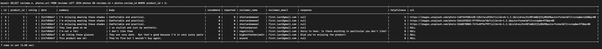

# July 12th, 2022

## Goals:
- [ ] Create queries/refine routes

## Notes:
- Use ```ORDER BY``` to specify sort order
- Use indexes to opimize columns??? ```ALTER TABLE TABLE_NAME ADD INDEX (COLUMN_NAME);``` https://stackoverflow.com/questions/3002605/how-do-i-add-indexes-to-mysql-tables
- How to left join urls into one row of reviews table???? --> comma separated list??
- USE ```AVG``` in sub query to create/select reviews meta data
- left joins vs sub-queries??
- no characteristics data in reviews table/only needed for reviews meta data???
- mySQL plugins or

## CLI Scripts:
### get/reviews by review_id
- ```SELECT * FROM reviews LEFT JOIN photos ON reviews.id = photos.review_id WHERE product_id = 2;```
  - returns list of reviews, each with a url field vs column with array of urls 
- ```SELECT reviews.*, photos.url FROM reviews LEFT JOIN photos ON reviews.id = photos.review_id WHERE product_id = 2;```
  - returns list of reviews with url data & w/o extra columns 
- ```SELECT reviews.*, GROUP_CONCAT(url ORDER BY photos.id) AS url FROM reviews LEFT JOIN photos ON reviews.id = photos.review_id WHERE product_id = 2 GROUP BY reviews.id;```
  - Adding all photo urls to a single comma separated row

### put/reviews/review_id/report
- ```UPDATE reviews SET helpfulness=helpfulness+1 WHERE id = 1;``` -- WORKS!!!!
-
### put/reviews/review_id/report
- ```UPDATE reviews SET reported=true WHERE id = 1;``` -- PROBABLY WORKS!!!!

## Error codes:
-


## Explain decisions of file structure