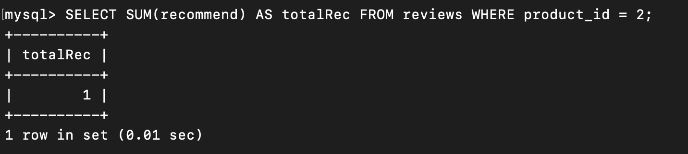
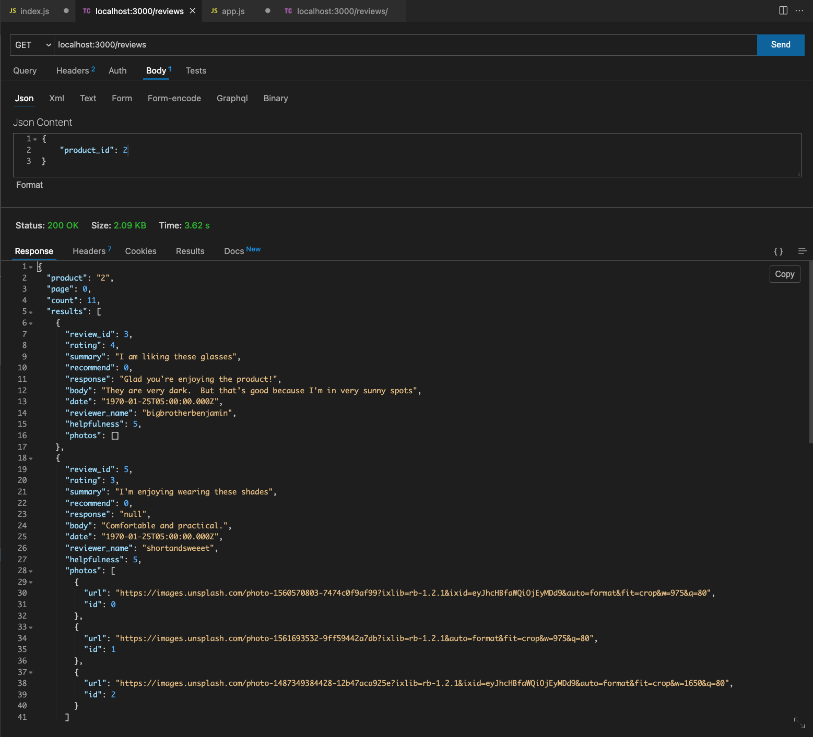
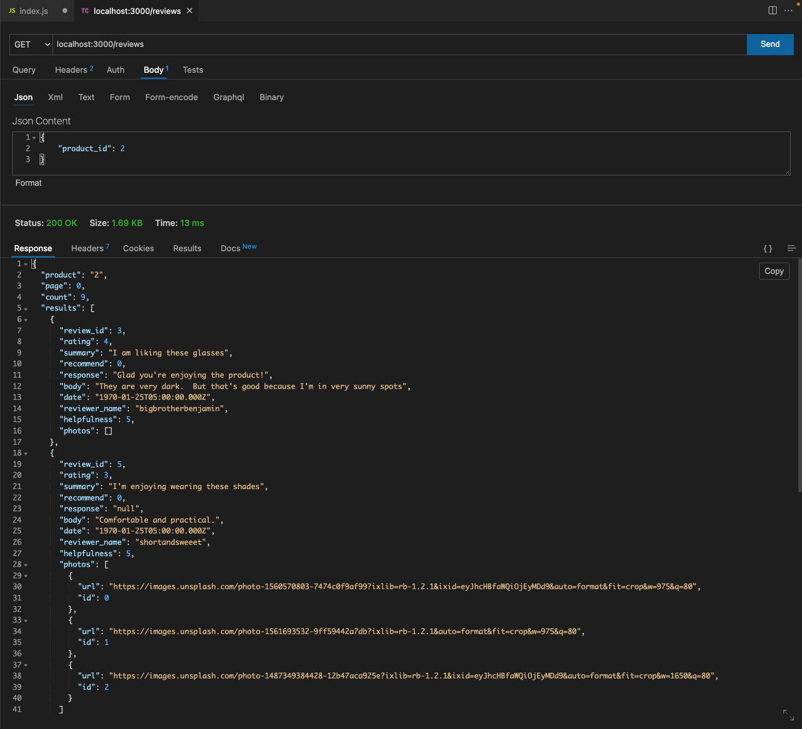

# July 13th, 2022

## Goals:
- [ ] finish create record query
- [ ] finish create meta query & shape data
- [ ] finish report record query
- [ ] create classes for review data to shape

## TODO:
- [X] update get/reviews to not return reported reviews (handle on server side or db)
- [X] how to handle url ids?? change query style
- [ ] reload dates into DB
- [X] convert date from DB (2147483647) to client ("2019-04-14T00:00:00.000Z")
- [ ] change date data type in schema (auto create for new record)

## Notes
-

## GOALS/TIMELINE
- [X] finsh post review by Thursday EOD
- [ ] finish Meta review Friday
- [ ] finish intergrating API & start stress testing Saturday

## CLI Scripts:
- ```select * from characteristics where product_id = 5;```
- ```INSERT INTO reviews(product_id, rating, date, summary, body, recommend, reported, reviewer_name,                          reviewer_email, response, helpfulness) VALUES (2, 4, 4, 'hello', 'world', 0, 0, 'Tyler', 'email', null, 0);```
- ```select * from characteristics_reviews where review_id = 2;```
- ```DROP INDEX product_id ON reviews;```
- ```DROP INDEX review_id ON photos;```
- ```SELECT SUM(recommend) AS recommended FROM reviews WHERE product_id = 2;``` 
- ```UPDATE reviews SET recommend=true WHERE id = 5774958; ```


## Error codes:
-


## Explain decisions of file structure

# PRE-INDEXING:

## Analysis:
Prior to indexing, the data base has to search through every entry in the data base to find the matching value in a row, which is an expensive mememory operation.

# POST-INDEXING:

## Analysis:
Post indexing, like a hash table, the most relivant columns have been index and it becomes a constant time operation to find a matching matching column in a row
