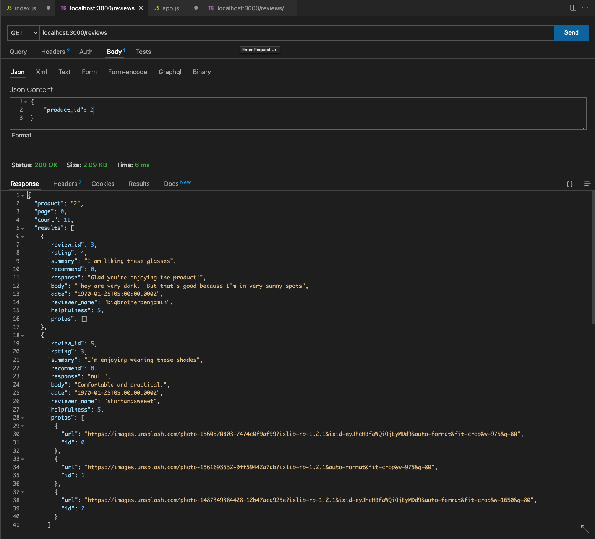

# July 14th, 2022

## Goals:
- [ ] finish create record query
- [ ] finish create meta query & shape data
- [ ] finish report record query
- [ ] create classes for review data to shape

## TODO:
- [X] update get/reviews to not return reported reviews (handle on server side or db)
- [X] how to handle url ids?? change query style
- [ ] reload dates into DB
- [X] convert date from DB (2147483647) to client ("2019-04-14T00:00:00.000Z")
- [ ] change date data type in schema (auto create for new record)

## Notes
-

## GOALS/TIMELINE
- [X] finsh post review by Thursday EOD
- [ ] finish Meta review Friday
- [ ] finish intergrating API & start stress testing Saturday

## CLI Scripts:
- ```LAST_INSERT_ID()``` (https://stackoverflow.com/questions/5178697/mysql-insert-into-multiple-tables-database-normalization)
- ```INSERT INTO photos(review_id, url) VALUES (LAST_INSERT_ID(), "https://images.unsplash.com/photo-1560570803-7474c0f9af99?ixlib=rb-1.2.1&ixid=eyJhcHBfaWQiOjEyMDd9&auto=format&fit=crop&w=975&q=80");```
- ```SELECT * FROM photos WHERE id = LAST_INSERT_ID();```
  .png)
- ```INSERT INTO photos(review_id, url) VALUES (5774954, 'https://images.unsplash.com/photo-1560570803-7474c0f9af99?ixlib=rb-1.2.1&ixid=eyJhcHBfaWQiOjEyMDd9&auto=format&fit=crop&w=975&q=80'), (5774954, 'https://images.unsplash.com/photo-1560570803-7474c0f9af99?ixlib=rb-1.2.1&ixid=eyJhcHBfaWQiOjEyMDd9&auto=format&fit=crop&w=975&q=80'), (5774954, 'https://images.unsplash.com/photo-1560570803-7474c0f9af99?ixlib=rb-1.2.1&ixid=eyJhcHBfaWQiOjEyMDd9&auto=format&fit=crop&w=975&q=80'), (5774954, 'https://images.unsplash.com/photo-1560570803-7474c0f9af99?ixlib=rb-1.2.1&ixid=eyJhcHBfaWQiOjEyMDd9&auto=format&fit=crop&w=975&q=80')`` -- DOESNT NOT WORK W/ EXTRA ',' AT END OF QUERY


## Error codes:
-


## Explain decisions of file structure

# PRE-INDEXING:

## Analysis:
Prior to indexing, the data base has to search through every entry in the data base to find the matching value in a row, which is an expensive mememory operation.

# POST-INDEXING:

## Analysis:
Post indexing, like a hash table, the most relivant columns have been index and it becomes a constant time operation to find a matching matching column in a row


## Notes
- Photos takes review_id(int) & url(string)
  -
- Characteristic takes: characteristic_id(int), review_id(int) & value(int)

