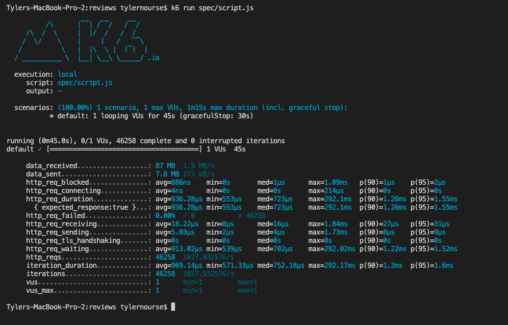

# July 21st, 2022

## Goals:
- [ ] finish intergrating API
- [X] start stress testing 
- [ ] create dummy data/finalize query return data

## GENERAL TODO:
- [ ] reload dates into DB
- [ ] change date data type in schema (auto create for new record)

## CLI Scripts:
-

## Notes
- caching, caching, caching!!!!

