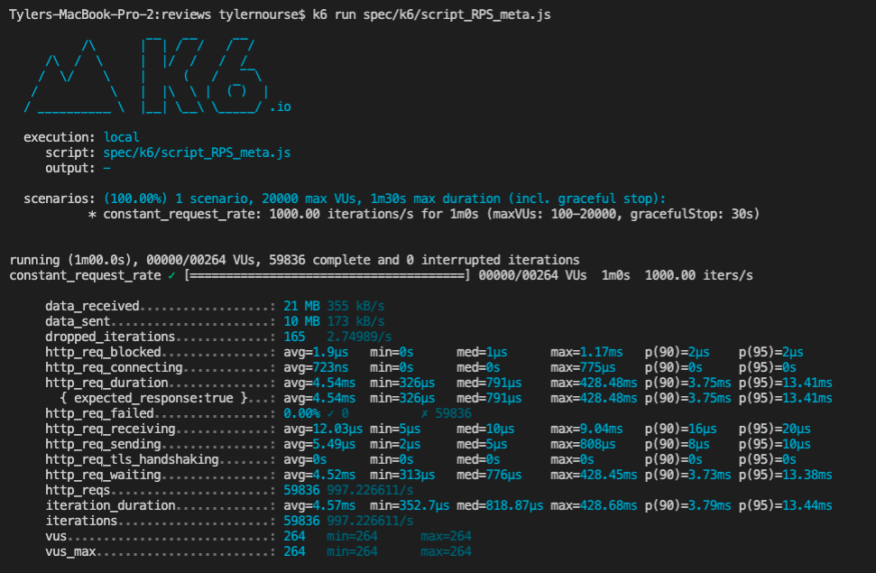
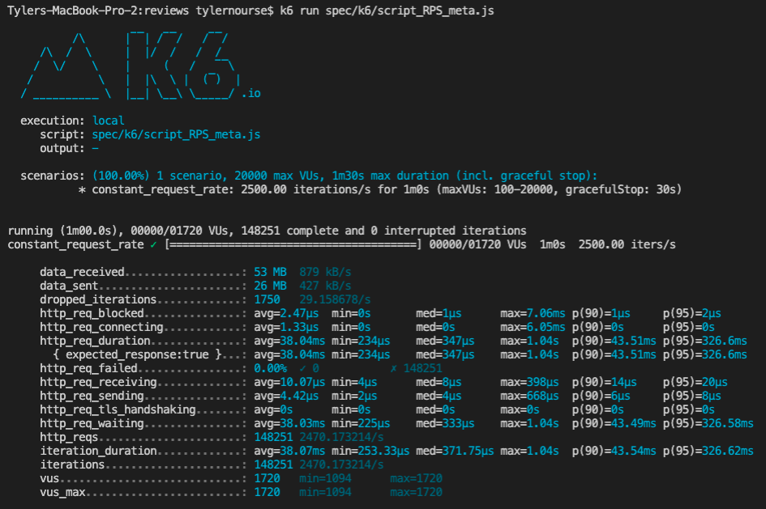
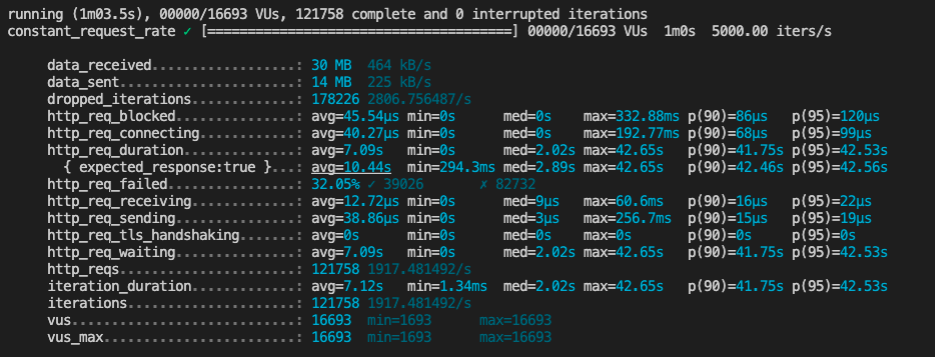

# July 23, 2022

## Goals:
- [ ] finish intergrating API
- [ ] create dummy data/finalize query return data

## GENERAL TODO:
- [ ] reload dates into DB
- [ ] change date data type in schema (auto create for new record)

## CLI Scripts:
-

## Notes
- caching, caching, caching!!!!

## Stress Testing /reviews:
- 1 RPS 
- 10 RPS 
- 100 RPS 
- 1000 RPS 
- 2500 RPS 
- 5000 RPS 

## Stress Testing /reviews/meta:
- 1000 RPS 
- 2500 RPS 
- 5000 RPS 