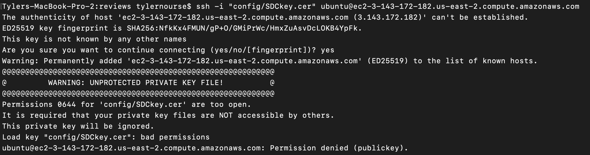
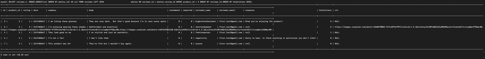
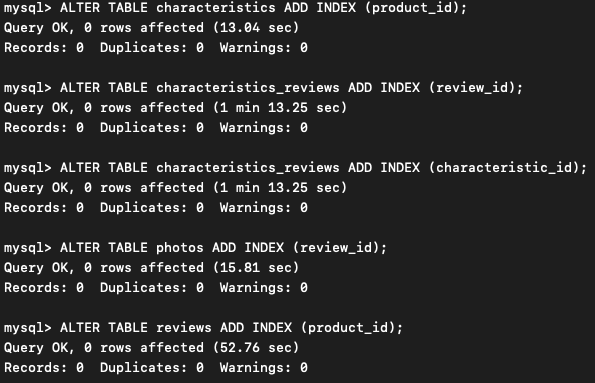
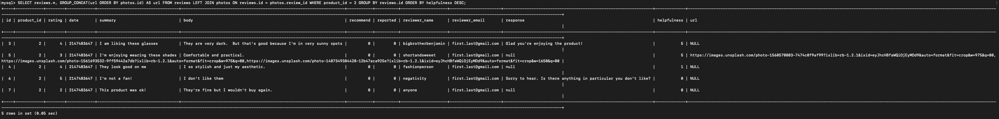

# July 26th, 2022

## Goals:
- [X] Database Deployed and data loaded on ec2
  
- [ ] Server Deployed on ec2
- [ ] Benchmark stress testing after deployment added to Engineering Journal (Screenshots and Analysis)
- [X] SDC Sprint Reflection
- [ ] HR Absence Notification (include info in email response to Stephanie) https://docs.google.com/forms/d/e/1FAIpQLSd6ttJuUJUwB-IAPMPlgwZcGBo3qgxVhGKrlwbsqCdf86eNgQ/viewform
- [X] Email response to Stephanie

## DO TO:
- [ ] Look into date errors in reviews table
- [ ] Look into reccomendation errors in reviews table
- [ ] *** UPDATE MOMS IP ADDRESS TO AWS SETTINGS BEFORE TRYING TO CONNECT ***

## Questions
- [X] how to import data onto EC2 instance from google drive url link??? (2.97 GB of .cvs files)
  - ```wget --load-cookies /tmp/cookies.txt "https://docs.google.com/uc?export=download&confirm=$(wget --quiet --save-cookies /tmp/cookies.txt --keep-session-cookies --no-check-certificate 'https://docs.google.com/uc?export=download&id=FILEID' -O- | sed -rn 's/.*confirm=([0-9A-Za-z_]+).*/\1\n/p')&id=FILEID" -O FILENAME && rm -rf /tmp/cookies.txt``` https://medium.com/@acpanjan/download-google-drive-files-using-wget-3c2c025a8b99

## Notes
- [X] USE NVM TO INSTALL NPM ON EC2 INSTANCE
  - ```sudo apt install curl```
  - ```curl https://raw.githubusercontent.com/creationix/nvm/master/install.sh | bash```
  - ```source ~/.bashrc```
  - ```nvm install node```
  - ```nvm install 16.14.2``` installs & switches node versions
  - ```node -e "console.log('Running Node.js ' + process.version)"``` === local=v16.14.2 / EC2=v16.16.0
- [ ] save an image of EC2 instance once mySQL is set up and running (as working backup image)
- [X] set up gitingore to sensitive files (refrence FEC project)
- [ ] Recommended: Containerize your service prior to deployment using Docker.
- [X] You should expect to use multiple EC2 instances: at least one for your service and one for your DBMS
- elastic IDS -- look up & set up
- *** USE SUDO IN UBUNTU ***
- [ ] create connection to mysql DBMS using EC2 url -- PORT = 3306
- [X] ***index db's***
- [ ] ports exposed
- [ ] look into if settings required to mysql to communicate as remote database
  - ```sudo vim /etc/mysql/mysql.conf.d/mysqld.cnf``` & set ```bind-address = 0.0.0.0```
  - https://www.digitalocean.com/community/tutorials/how-to-allow-remote-access-to-mysql
  - ```sudo ufw allow from 3.17.16.33 to any port 3306```


## ERRORS:
- Error connecting to EC2 instance ```ssh -i "config/SDCkey.cer" ubuntu@ec2-3-143-172-182.us-east-2.compute.amazonaws.com```
  
  - SOLUTION: (read instructions more careful) chmod 400 <filename>
- ERROR ```mysql> LOAD DATA LOCAL INFILE "~/Downloads/reviews.csv" INTO TABLE reviews COLUMNS TERMINATED BY ',' OPTIONALLY ENCLOSED BY '"' ERROR 2068 (HY000): LOAD DATA LOCAL INFILE file request rejected due to restrictions on access.```
  - start mysql with correct permissions ```sudo mysql --local-infile=1 -u root```
  - https://stackoverflow.com/questions/59993844/error-loading-local-data-is-disabled-this-must-be-enabled-on-both-the-client

## EC2 PRE-INDEXING:


## OPIMIZATIONS:


## EC2 POST-INDEXING:
