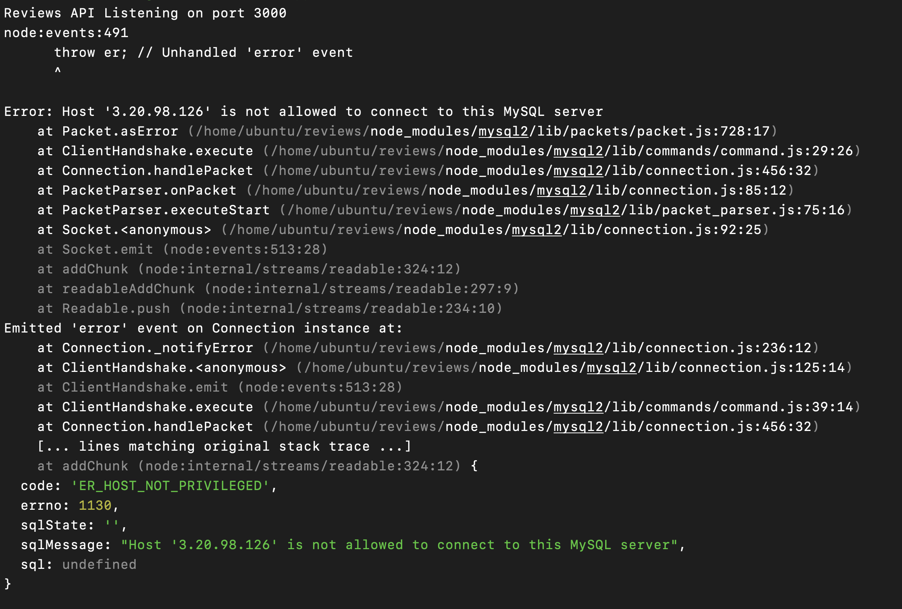
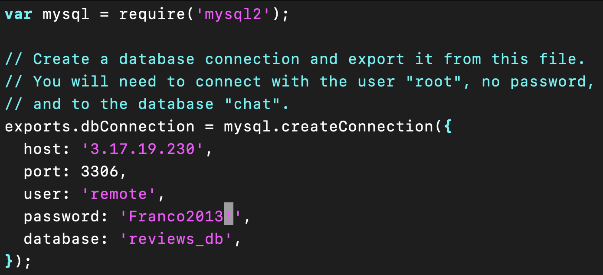
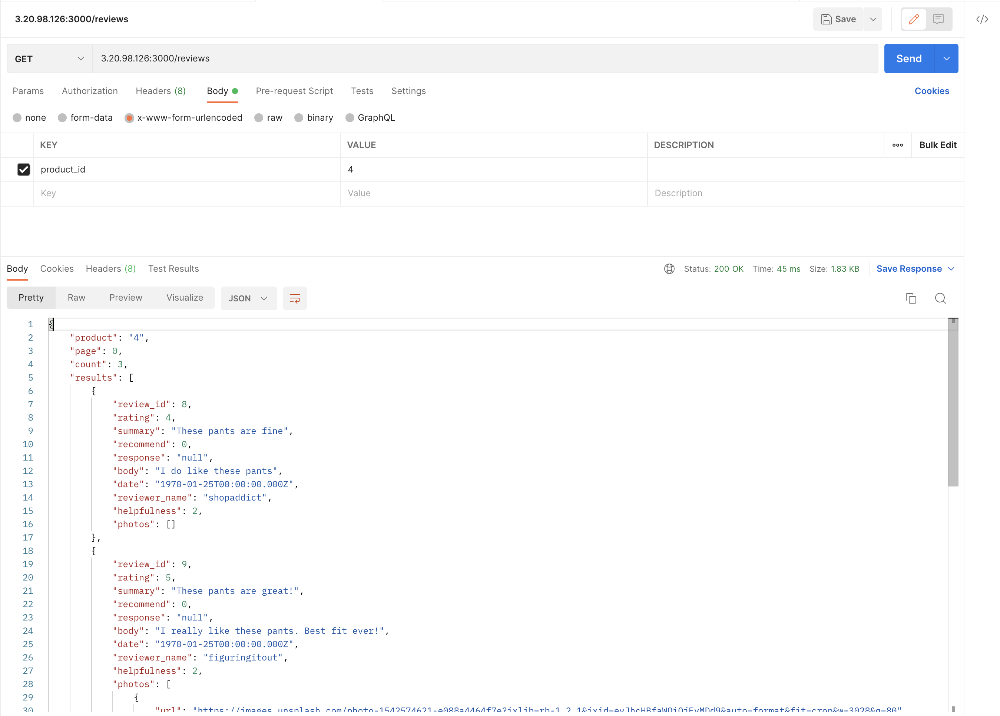

# July 27th, 2022

## Goals:
- [ ] Server Deployed on ec2
- [ ] Benchmark stress testing after deployment added to Engineering Journal (Screenshots and Analysis)
- [ ] HR Absence Notification (also email Stephanie) https://docs.google.com/forms/d/e/1FAIpQLSd6ttJuUJUwB-IAPMPlgwZcGBo3qgxVhGKrlwbsqCdf86eNgQ/viewform

## DO TO:
- [ ] Look into date errors in reviews table
- [ ] Look into reccomendation errors in reviews table
- [X] *** UPDATE MOMS IP ADDRESS TO AWS SETTINGS BEFORE TRYING TO CONNECT ***

## Questions
- [ ] how to connect EC2 DBMS with EC2 server??
  -  https://phoenixnap.com/kb/mysql-remote-connection

## Notes
- [ ] save an image of EC2 instance once mySQL is set up and running (as working backup image)
- [ ] Recommended: Containerize your service prior to deployment using Docker.
- *** USE SUDO IN UBUNTU ***
- [ ] create connection to mysql DBMS using EC2 url -- PORT = 3306
- [X] ***index db's***
- [X] ports exposed
- [ ] look into if settings required to mysql to communicate as remote database
  - ```sudo vim /etc/mysql/mysql.conf.d/mysqld.cnf``` & set ```bind-address = 0.0.0.0```
  - https://www.digitalocean.com/community/tutorials/how-to-allow-remote-access-to-mysql
  - ```sudo ufw allow from 3.17.16.33 to any port 3306```
  - modifications to db/index.js === ```host: '3.143.172.182'``` & ```port: 3306,```

## OFFICE HOURS NOTES & QUESTIONS:
- [X] New Relic M1 MBP
- [X] confirm mental model of connecting DBMS EC2 & server EC2 instances
- install loader.io to deployed SDC project: use express.static to serve the loader.io static file
- update deployed SDC project to new relic


## CLI SCRIPTS:
- ```ssh -i "config/SDCkey.cer" ubuntu@ec2-3-143-172-182.us-east-2.compute.amazonaws.com```

## ERROR

- https://www.linuxandubuntu.com/home/sqlstatehy000-1130-host-not-allowed-to-connect-to-this-mysql-server
- ```sudo systemctl restart mysql```
- ```sudo vim /etc/mysql/mysql.conf.d/mysqld.cnf```
- ```CREATE USER 'remote'@'3.20.98.126' IDENTIFIED BY 'Franco2013!';```
- ```GRANT ALL PRIVILEGES ON reviews_db.* to 'remote'@'3.20.98.126';```
- 
- 