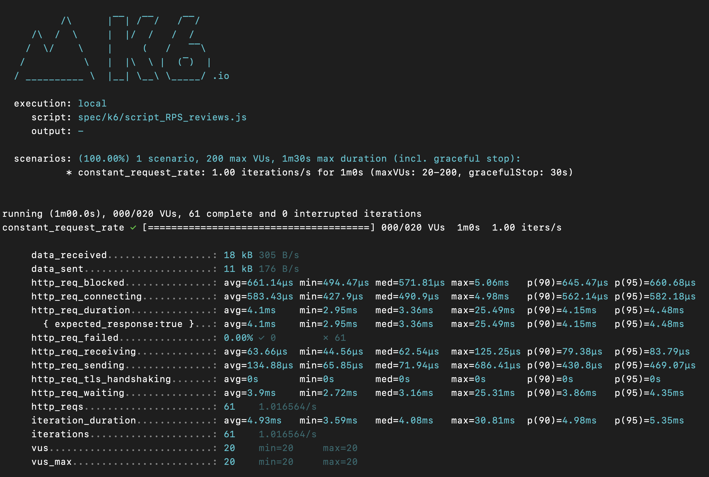
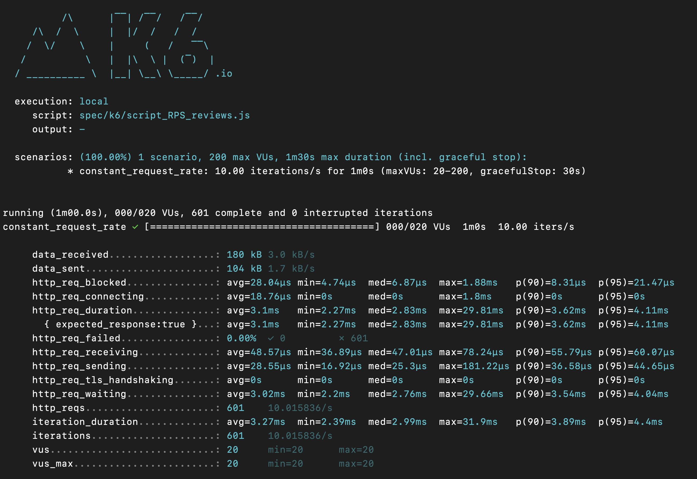
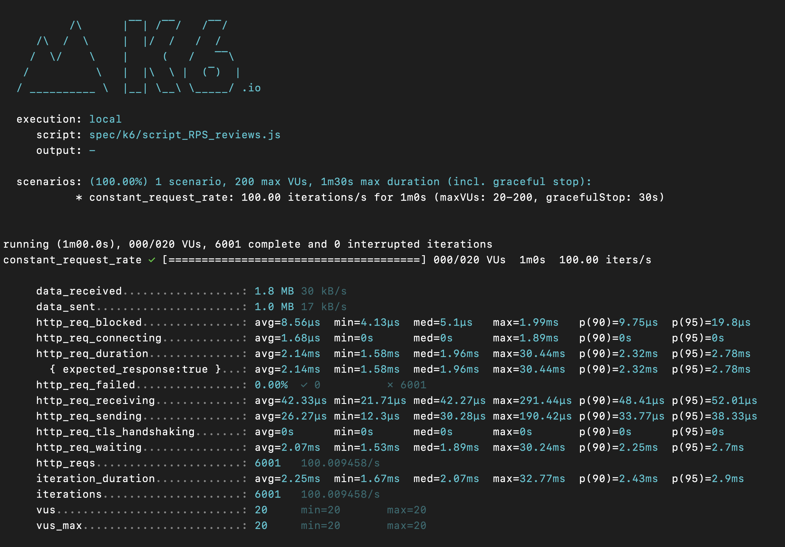
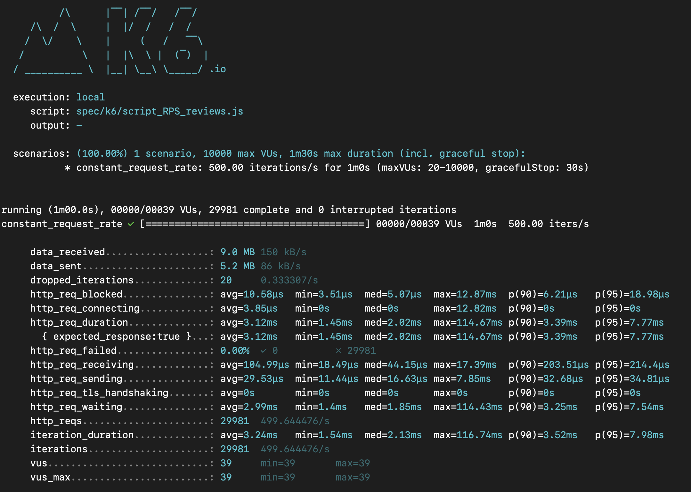
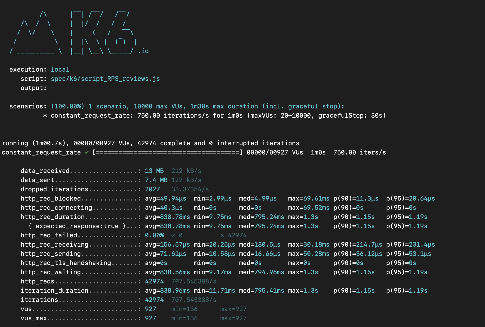
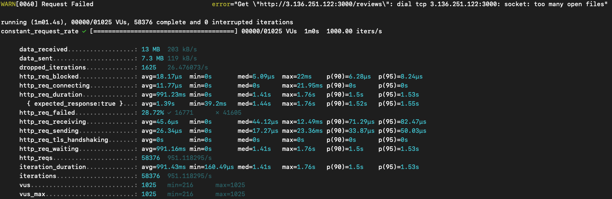

# August 3rd, 2022

## Goals:
- [ ] Make a help desk ticket on how to best manage EC2 server git repo & ask about loader.io GET request body
- [ ] Benchmark stress testing after deployment added to Engineering Journal (Screenshots and Analysis)

## DO TO:
- [ ] Look into date errors in reviews table
- [ ] Look into reccomendation errors in reviews table
- [ ] *** INTERGRATE URLS INTO FEC ***

## Notes
- [ ] save an image of EC2 instance once mySQL is set up and running (as working backup image)
- [ ] Recommended: Containerize your service prior to deployment using Docker.
- *** USE SUDO IN UBUNTU ***


## CLI SCRIPTS:
- To launch SDC_Sever_2 instance: ```ssh -i "config/SDCkey.cer" ubuntu@ec2-3-136-251-122.us-east-2.compute.amazonaws.com```

## ERRORS:
- [ ] WARN[0060] Request Failed error="Get \"http://3.20.98.126:3000/reviews\": dial tcp 3.20.98.126:3000: socket: too many open files"
  - https://stackoverflow.com/questions/880557/socket-accept-too-many-open-files
  - check max open files with ```ulimit -n```
  - To change max open file, traverse to root folder and set limit w/ ```ulimit -n <#>```

## EC2 BENCHMARKING:
- 1 RPS: 
- 10 RPS: 
- 100 RPS: 
- 500 RPS: 
- 750 RPS: 
- 1000 RPS: 


## NOTES:
- vertical scale by increasing EC2 teir
- catching calls -- redis
- nginx -- round robin config
- I just remembered what was causing that issue with my instances. The instances have a built in memcache. It is a temporary default cache that hold the data you just processed. It is pretty limited in size and it doesn’t empty right away, so when you run a lot of requests it can fill up and cause an error.  This could explain why your instance started working again after waiting for a while.
The solutions that I found were increasing you memcache’s reserved space, but that reduces the memory(and thus the speed) that you have to run requests current requests. You can also write some kind of script to have your memcache empty every minute or so, but the instructions on that seemed very advanced.